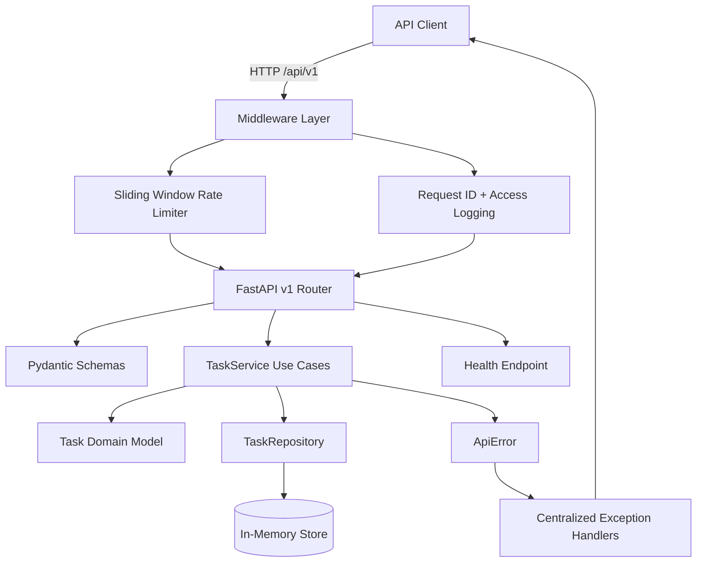

# TaskFlow API

**A production-style task management REST API built with FastAPI, clean architecture, structured logging, rate limiting, and versioned endpoints.**

[](https://www.python.org/)
[](https://fastapi.tiangolo.com/)
[](https://docs.pytest.org/)
[](https://docs.astral.sh/ruff/)
[](LICENSE)

</div>

---

## Why this project stands out

TaskFlow API is intentionally structured like a senior-level backend portfolio project rather than a single-file demo. It demonstrates clean boundaries between API routes, services, domain models, repository abstractions, and cross-cutting platform concerns.

### Highlights

- **Versioned REST API** under `/api/v1` with OpenAPI docs at `/api/v1/docs`.
- **Centralized error handling** with consistent JSON error envelopes and request IDs.
- **Structured JSON logging** for production-friendly observability.
- **Request correlation middleware** using `X-Request-ID`.
- **In-memory sliding-window rate limiting** with response headers.
- **Health check endpoint** for readiness and uptime probes.
- **Clean architecture layout** separating routes, services, domain, schemas, and core infrastructure.
- **Automated tests** covering health checks, task CRUD workflows, validation errors, not-found errors, and rate limiter behavior.

---

## API architecture



---

## Project structure

```text
TaskFlow-Api/
├── app/
│   ├── api/v1/routes.py          # Versioned HTTP endpoints
│   ├── core/                     # Config, logging, errors, middleware, rate limiting
│   ├── domain/                   # Domain entities and repository implementation
│   ├── services/                 # Application use cases
│   ├── dependencies.py           # Dependency injection wiring
│   ├── main.py                   # FastAPI application factory
│   └── schemas.py                # Request/response contracts
├── tests/                        # Pytest coverage for API behavior and rate limiting
├── pyproject.toml                # Package metadata, dependencies, and tooling
└── README.md
```

---

## Quick start

### 1. Create a virtual environment

```bash
python -m venv .venv
source .venv/bin/activate
```

### 2. Install dependencies

```bash
pip install -e '.[dev]'
```

### 3. Run the API

```bash
uvicorn app.main:app --reload
```

Open the interactive documentation:

- Swagger UI: <http://127.0.0.1:8000/api/v1/docs>
- ReDoc: <http://127.0.0.1:8000/api/v1/redoc>
- Health: <http://127.0.0.1:8000/api/v1/health>

---

## Example requests

### Create a task

```bash
curl -X POST http://127.0.0.1:8000/api/v1/tasks \
  -H 'Content-Type: application/json' \
  -H 'X-Request-ID: demo-request' \
  -d '{"title":"Design API polish","description":"Add senior-level platform concerns"}'
```

### List tasks

```bash
curl http://127.0.0.1:8000/api/v1/tasks
```

### Check service health

```bash
curl http://127.0.0.1:8000/api/v1/health
```

---

## Error response format

All expected application and validation failures use a predictable envelope:

```json
{
  "error": {
    "code": "task_not_found",
    "message": "Task was not found.",
    "request_id": "4e846b1d-1f9a-47ab-8a45-7e695d50c73f",
    "details": {
      "task_id": "..."
    }
  }
}
```

---

## Configuration

| Variable | Default | Description |
| --- | --- | --- |
| `APP_NAME` | `TaskFlow API` | Service name returned by health checks and OpenAPI metadata. |
| `ENVIRONMENT` | `development` | Environment label for diagnostics. |
| `API_V1_PREFIX` | `/api/v1` | Versioned route prefix. |
| `LOG_LEVEL` | `INFO` | Root logging level. |
| `CORS_ORIGINS` | `*` | Comma-separated list of allowed origins. |
| `RATE_LIMIT_REQUESTS` | `60` | Requests allowed per client window. |
| `RATE_LIMIT_WINDOW_SECONDS` | `60` | Sliding-window duration in seconds. |

---

## Quality checks

```bash
pytest
ruff check .
```

The test suite exercises the critical user-facing contract: successful CRUD operations, health status, structured error handling, validation failures, request ID propagation, and rate limiter behavior.

---

## Roadmap

- Replace the in-memory repository with PostgreSQL and SQLAlchemy.
- Add JWT authentication and role-based access control.
- Add Docker Compose for API + database + observability stack.
- Add CI with coverage reporting and container image scanning.

---

## License

This project is licensed under the [MIT License](LICENSE).
